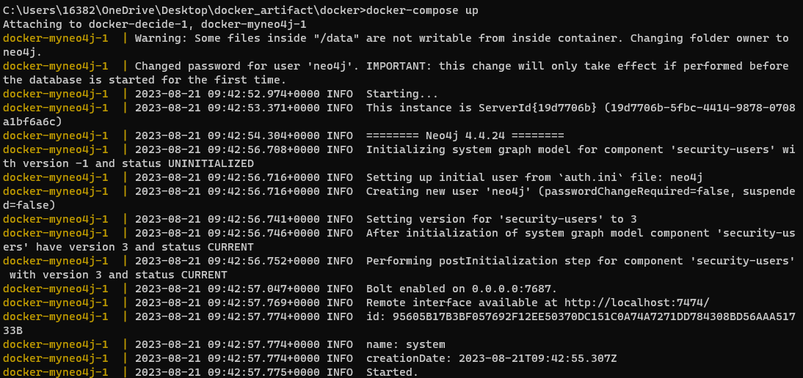
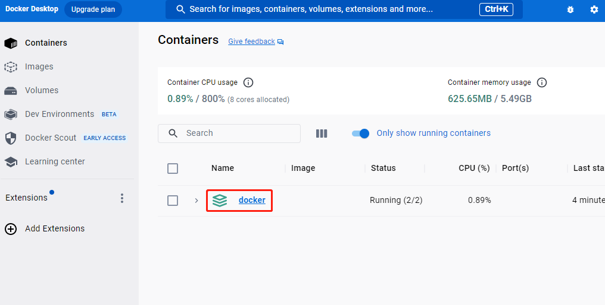
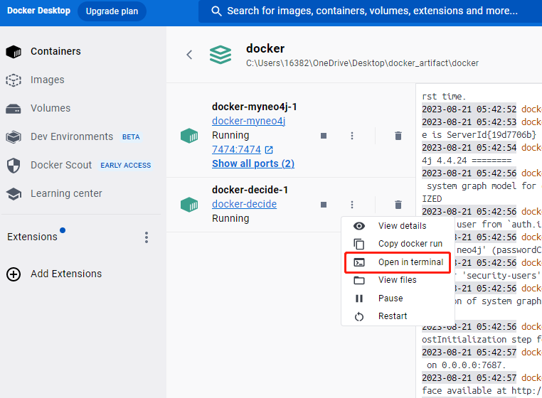
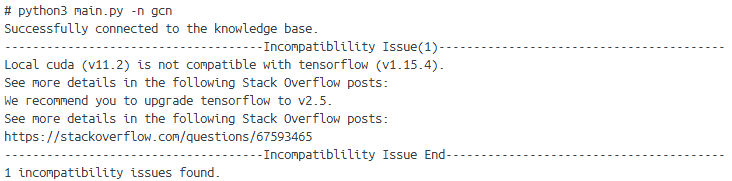

# Installation

In this file we present the installation steps for running DECIDE. To help users know more details on the whole pipeline, we also provide installation instructions for running an example of knowledge extracting and and example of knowledge graph querying.

## DECIDE

Here we provide instructions on how to set up our tools, DECIDE. DECIDE can be installed either locally or in Docker.

### Local Installation

To set up DECIDE, please ensure that you have installed [Python](https://www.python.org/) and [Anaconda](https://www.anaconda.com/). Note that all the code were tested on Ubuntu 18.04 without using GPU.

First, install [Neo4j](https://neo4j.com/). The tested version is v4.4.8. Please load the knowledge graph by running:

```shell
$ cd /PATH/TO/DECIDE
$ cp DECIDE-KnowledgeGrpah.dump /PATH/TO/NEO4J/data/databases/
$ cd /PATH/TO/NEO4J
$ bin/neo4j stop
$ # Dump the knowledge graph
$ bin/neo4j-admin load --from=data/databases/DECIDE-KnowledgeGrpah.dump
$ # Start Neo4j
$ bin/neo4j start
```

 Then change the configuration in `DECIDE/config/neo4j.json`:

```json
{
    "protocol": "http",
    "host": "YOUR HOST",
    "port": "YOUR PORT",
    "user": "YOUR USERNAME",
    "password": "YOUR PASSWROD"
}
```

Note that we provide an on-line Neo4j service, the configuration are as follows:

```json
{
    "protocol": "http",
    "host": "116.62.100.101",
    "port": "22467",
    "user": "neo4j",
    "password": "so-knowledge-summer-20220725-467"
}
```

We strongly recommend users to reproduce our code in a new virtual Python environment.  One can create a new environment using Anaconda:

```shell
$ conda create -n YOUR_ENV_NAME python=3.6 -y
$ conda activate YOUR_ENV_NAME
```

To install all the required libraries for DECIDE, run:

```shell
$ cd PATH/TO/DECIDE
$ pip install -r requirements.txt 
```

To test the project in our benchmarks, run:

```shell
$ python main.py -n PROJECT_NAME
$ # example: python main.py -n gcn
```

To replay the evaluation in our benchmark, please run:

```shell
$ chmod +x experiment.sh
$ ./experiment.sh
```

The results will be generated in `DECIDE/detection_result`.

### Docker Installation

After Docker is installed,  change the working directory to `Docker` folder in the repository with:

```shell
$ cd PATH/TO/DECIDE/Docker
```

Start the docker container with the following command:

```sh
$ docker compose up
```

You should see the following output.




By now, you should be able to see a running docker container named `docker` in your docker desktop.




The `docker` container should contain two separate docker containers (`myneo4j` and `decide`). Proceed to the terminal of `decide`:



Now, you can run DECIDE and reproduce all our experimental results following the instructions from the README file. For example, try running:

```shell
$ python3 main.py -n gcn
```

You should see the following output:



## Knowledge Extraction Examples

First, create a new virtual Python environment using Anaconda:

```shell
$ conda create -n YOUR_ENV_NAME python=3.6 -y
$ conda activate YOUR_ENV_NAME
```

Then, install all the required libraries for constructing the knowledge graph, run:

```shell
$ cd PATH/TO/DECIDE/Knowledge-Extraction-Example/
$ pip install -r requirements.txt 
$ pip install en_core_web_sm-2.3.1.tar.gz
```

To get a quick view on knowledge extraction pipeline, run:

```shell
$ cd PATH/TO/DECIDE/Knowledge-Extraction-Example/
$ python example.py
```

## Knowledge Graph Query Examples

First, install Neo4j (see above) and change the configuration file `DECIDE/Knowledge-Base-Query-Example/config.json`:

```
{
    "protocol": "http",
    "host": "YOUR HOST",
    "port": "YOUR PORT",
    "user": "YOUR USERNAME",
    "password": "YOUR PASSWROD"
}
```

Then, create a new virtual Python environment using Anaconda:

```shell
$ conda create -n YOUR_ENV_NAME python=3.6 -y
$ conda activate YOUR_ENV_NAME
```

Then, install all the required libraries:

```shell
$ pip install py2neo 
```

To get a quick view on knowledge graph Query Examples, run:

```shell
$ cd PATH/TO/DECIDE/Knowledge-Base-Query-Example/
$ python example.py
```

